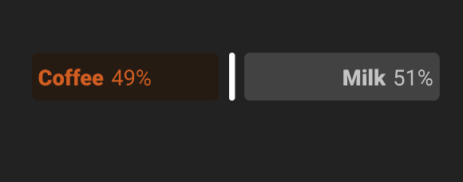

# Coffee Slider



> How would you like your coffee?

A Slider component with fun scaling

## Usage

```jsx
<Slider
  initialValue={0.5}
  leftLabel="Coffee"
  rightLabel="Milk"
  onChange={(value) => console.log(value)}
/>
```
